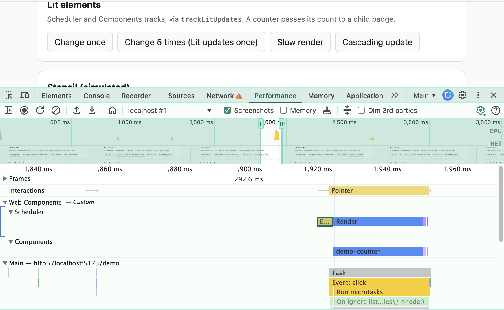

# custom-element-perf-tracks

Shows your web components in the Chrome DevTools Performance panel, the same way React shows its components.

React 19.2 added [performance tracks](https://react.dev/reference/dev-tools/react-performance-tracks) to the Performance panel, so React developers can see what caused each update, how long each step took, and which components did the work. This library adds the same tracks for custom elements, Lit and Stencil, with the same names and colors.



## Install

```sh
npm install custom-element-perf-tracks
```

## Quick start

Add this as the first import in your app's entry file, before any components load:

```js
import "custom-element-perf-tracks/register";
```

Every custom element defined after that is tracked, and Lit elements also get their updates tracked, with no other changes to your code. Record a profile in the Performance panel and a **Web Components** group appears.

None of it reaches production builds. See [Production builds](#production-builds).

## What you see

**Scheduler** shows each update as a row of steps, like React's Scheduler track:

| Bar | What it covers |
| --- | --- |
| **Event: click** | The event handler that made the change, up to the change itself. Any user input event works, not only clicks. |
| **Update** | The wait between the change and Lit starting the update. It becomes **Update Blocked** when the wait is over 5 ms. |
| **Render** | `shouldUpdate`, `willUpdate` and `render`. |
| **Commit** | Writing the result to the page, then `firstUpdated` and `updated`. |
| **Cascading Update** | Red. The element changed its own properties after rendering, usually in `updated()`, so Lit had to update it a second time. |

**Components** shows which element did the work, like React's Components track:

| Bar | What it covers |
| --- | --- |
| **my-element** (blue) | The element's render. Clicking it shows **Changed Props** with old and new values, how many **Changes batched** into the update, and which parent it was **Triggered by**. |
| **my-element** (purple) | The element's `firstUpdated()` and `updated()` work. |
| **Mount** | Wraps an element's first update. |
| **my-element connected** | Lifecycle callbacks: `connected`, `disconnected`, `attributeChanged` and `adopted`. |

**Upgrade** shows each `customElements.define` call, which upgrades every matching element already in the page. Clicking it shows how many were upgraded.

Bars get darker as work gets slower, using React's thresholds. Anything that throws gets a red bar with the error message.

## Instrumenting specific elements

The quick start covers most apps. To instrument only some elements instead:

```js
import { definePerf } from "custom-element-perf-tracks";
import { trackLitUpdates } from "custom-element-perf-tracks/lit";

// Instead of customElements.define:
definePerf("my-card", MyCard);

// In a Lit element's constructor:
class MyCounter extends LitElement {
  constructor() {
    super();
    trackLitUpdates(this);
  }
}
```

`instrumentElement(MyCard)` adds the lifecycle bars without defining the element. It has to run before the class is defined.

## Stencil

Stencil records its own timings in dev builds, and in builds made with `stencil build --profile`. One call at startup shows them on the same tracks:

```js
import { observeStencilProfile } from "custom-element-perf-tracks/stencil";

observeStencilProfile();
```

Stencil's timing for `render()` includes patching the page, so each update is one **Render and Commit** bar. A **Loading** track shows the app starting and each component's code being loaded, with extra rows when loads overlap.

## Design systems

By default every element's bars go in one **Web Components** group. A design system can put its own elements in a group of their own, so its work shows up separately from the app's, and from any other library on the page:

```js
import { assignTrackGroup } from "custom-element-perf-tracks";

// Every element that extends the design system's base class.
assignTrackGroup(AcmeElement, "Acme Design System");

// Or every element whose tag starts with a prefix.
assignTrackGroup("acme-", "Acme Design System");
```

Each call adds a rule without replacing anyone else's, so the app and every library it uses can add their own. A class rule covers the class and everything that extends it, and wins over a prefix rule. Among prefixes, the longest match wins. Each group gets its own Scheduler, Components and Upgrade tracks.

A design system can depend on this package directly. Apps that use it get the empty production version in their production builds, so the rules cost nothing there.

## Production builds

The package has an empty version with the same API, and bundlers pick it for production builds:

| Tool | Production build |
| --- | --- |
| Vite | Empty version, automatically |
| webpack (`mode: "production"`) | Empty version, automatically |
| esbuild | Empty version with `--conditions=production` |
| Rollup | Empty version with `exportConditions: ["production"]` in `@rollup/plugin-node-resolve` |

Any tool that supports the standard `"production"` [export condition](https://nodejs.org/api/packages.html#conditional-exports) works the same way. Without a bundler, `configure({ enabled: false })` turns it off.

Vite and webpack decide from `NODE_ENV`, so a dev server started with `NODE_ENV=production` set gets the empty version and shows no tracks.

## Settings

```js
import { configure } from "custom-element-perf-tracks";

configure({
  trackGroup: "My App",   // rename the group in DevTools
  minDuration: 0,         // draw even the shortest callbacks (default 0.05 ms)
  strategy: "timestamp",  // lighter bars, without details
  enabled: false,         // turn it off completely
});
```

`configure` needs to run before your elements are defined.

`strategy` sets how bars are drawn. The default, `"auto"`, uses `performance.measure` and removes each entry from the performance buffer straight away. `"measure"` leaves them in the buffer, for test scripts to read. `"timestamp"` uses `console.timeStamp` and drops the details.

## Demo

```sh
npm install
npm run demo
```

Open `http://localhost:5173/demo/`, record in the Performance panel, click a few buttons, then stop.

## Limitations

- Tracks only appear in Chrome and Edge. Other browsers ignore the extra data.
- Work faster than a tenth of a millisecond has no visible length, so it isn't drawn.
- Only synchronous work is timed.
- Lit elements update one at a time, so their bars sit side by side instead of nesting the way React's do. **Triggered by** links a child's update to its parent.

## Development

`npm test` runs the tests, which need Chrome or Chromium (set `CHROME_PATH` if it isn't found). `npm run coverage` reports test coverage.

## License

MIT
