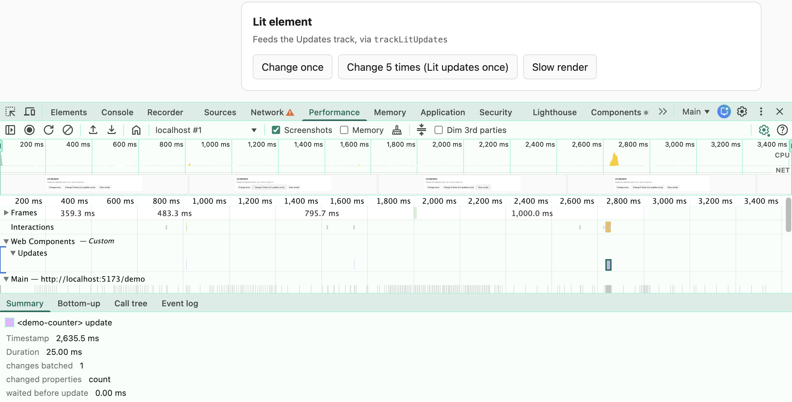

# custom-element-perf-tracks

Shows your web components in the Chrome DevTools Performance panel.



React 19.2 added its own tracks to the Performance panel, so React developers can see which component rendered and how long it took. Web components had no equivalent. This library fills that gap for custom elements, Lit and Stencil, using Chrome's [Performance Extensibility API](https://developer.chrome.com/docs/devtools/performance/extension).

After recording a profile, a **Web Components** group appears in the flame chart with three tracks:

| Track | What it shows | Source |
| --- | --- | --- |
| **Upgrade** | The `customElements.define` call, which upgrades every matching element already in the page, including inside shadow roots | `definePerf` |
| **Lifecycle** | Each `connected`, `disconnected`, `attributeChanged` and `adopted` callback, per element | `definePerf`, `instrumentElement`, Stencil |
| **Updates** | Each Lit update, with how many changes Lit batched into it; or Stencil's own update timings | `trackLitUpdates`, `observeStencilProfile` |

Selecting a bar shows extra details, such as which attribute changed, how many elements were upgraded, or which properties a Lit update picked up. Anything that throws gets a red bar.

## Install

```sh
npm install custom-element-perf-tracks
```

## Use

### Any custom element

Swap `customElements.define` for `definePerf`:

```js
import { definePerf } from "custom-element-perf-tracks";

definePerf("my-card", MyCard);
```

If something else does the defining, call `instrumentElement(MyCard)` first instead. It has to run before the class is defined, because that is when browsers read the lifecycle callbacks; calling it later logs a warning and does nothing.

Classes that extend each other can all be instrumented. Each callback still produces one bar, named after the element that ran it.

### Lit

Call `trackLitUpdates` from the constructor:

```js
import { LitElement } from "lit";
import { trackLitUpdates } from "custom-element-perf-tracks/lit";

class MyCounter extends LitElement {
  constructor() {
    super();
    trackLitUpdates(this);
  }
}
```

Each bar covers Lit's whole update: `shouldUpdate`, `willUpdate`, `render` and writing the result to the page, then `firstUpdated` and `updated`. Its details show:

- **changes batched**: how many property changes Lit folded into this one update. Setting a property to the value it already has is not counted.
- **changed properties**: their names.
- **waited before update**: the time between the first change and the update starting.

Updates that `shouldUpdate` skips appear as light "update skipped" bars, and updates that throw appear as red "update failed" bars.

The adapter only uses Lit's public API and has no runtime dependency on Lit. It is tested with Lit 3, and should also work with Lit 2.

### Stencil

Stencil records its own timings in dev builds, and in production builds made with `stencil build --profile`. Once at startup:

```js
import { observeStencilProfile } from "custom-element-perf-tracks/stencil";

observeStencilProfile();
```

This copies those timings onto the tracks above, rather than timing the same work again. Stencil's originals stay in DevTools' generic "Timings" lane too, so each one appears twice.

### Settings

```js
import { configure } from "custom-element-perf-tracks";

configure({
  enabled: process.env.NODE_ENV !== "production",
  trackGroup: "My App",     // rename the group in DevTools
  strategy: "timestamp",    // lighter mode, see below
});
```

Call `configure` before defining elements. When `enabled` is `false` at that point, elements and Lit components are left completely untouched, though the library's code is still in the bundle. Settings passed as `undefined` are ignored.

There are two ways to draw bars:

- **`"measure"`** (default) uses `performance.measure`. Bars carry the details described above. Each bar also adds an entry to the page's performance buffer, which grows over a long session.
- **`"timestamp"`** uses `console.timeStamp`. Much cheaper, and adds nothing to the buffer, but bars show only a name and colour.

## Try the demo

```sh
npm install
npm run demo
```

Open `http://localhost:5173/demo/`, open DevTools, record in the Performance panel, click a few buttons, then stop. Add `?strategy=timestamp` to try the lighter mode.

## Good to know

- **Chrome and Edge only** for the tracks themselves. Other browsers ignore the extra data, so nothing breaks there.
- **Very fast work can vanish.** Browsers round timestamps to about a tenth of a millisecond, so anything faster has zero length and DevTools does not draw it.
- **Only synchronous work is timed.** A lifecycle callback that starts async work gets a bar for the synchronous part only.

## Tests

`npm test` runs everything. The browser tests need Chrome or Chromium; they look in the usual places, or set `CHROME_PATH`. They include an end-to-end check that runs the demo, records a real performance trace, and parses it with DevTools' own trace engine ([`@paulirish/trace_engine`](https://www.npmjs.com/package/@paulirish/trace_engine)) to confirm the Performance panel would draw all three tracks, in both modes.

## Licence

MIT
